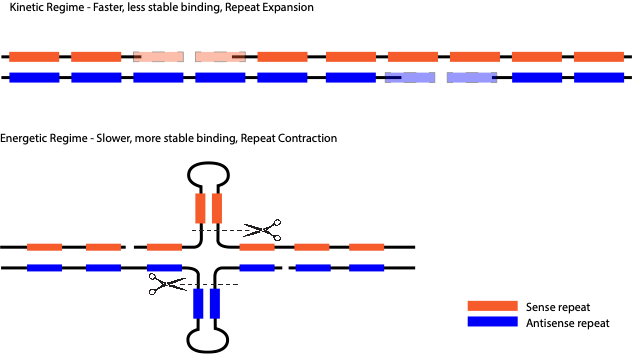

# Introduction

The overwhelming diversity of life on earth is evidence of the ability of biological systems to adapt and diversify to an extent unmatched by other complex physical systems. It is clear that given enough time, we could engineer biological matter to solve pressing human problems: for example, we could evolve bacteria to consume toxic waste, modify plants to be more heat and drought resistant, or create cell lines that are particularly well suited for making drugs. The primary goal of this research program would be to make the process of evolving biological systems to solve problems faster, more efficient, and more general.  We aim do this by focusing resources on *Cell Learning*.

# Scientific Background

The traditionalist view of biology considers the genome as a central “blueprint” from which function and structure emerge as a directed, acyclic map, a so-called “genotype $\to$phenotype” map.  Evolution occurs through changes to the blueprint which propagate to changes in phenotype and eventually fitness, subjected to selection as the “survival of the fittest”. These changes, or mutations, are dogmatically taken to be random both in space and time.  Spatially random means that changes are to be uniform over genome position, and temporally random means that they occur at random times and not e.g. in response to environmental cues.  

The classic experiment of Luria and Delbruk, is thought to have proven, once and for all, that mutations occur randomly in time, and are not *directed*.  It is clear now that, while this beautiful, foundational experiment in quantitative biology demonstrates that it is true that mutations of *Escherichia coli* that provide resistance to phage infection arise randomly, it is not true for all biological systems.  In a sense, this experiment was almost too beautiful, and its results served to stifle research on directed mutation for decades, as discussed at length below, in the context of the work of [Susan M. Rosenberg](people/susan-m-rosenberg.qmd) and [Jonathan Houseley](people/jonathan-houseley.qmd), among others.  

Among evolutionary biologists, non-random mutation is known as *directed* mutation. There has been a long and contentious [debate](references/index.qmd) about the existence of directed mutations, but their existence has been clearly settled. As is common in this field, remarkable results are often met with small and grudging concessions.  Once the existence of a phenomenon is proved, it is reluctantly accepted with caveats, one of the most common being, that yes it exists but no it is not beneficial, or adaptive. Thus the existence of directed mutation was quickly superseded by the non-existence of adaptive mutation.  The new dogma is then that directed mutations are simply the results of the breakdown of normally high-fidelity systems and the “blind watchmaker” is replaced by the “sick watchmaker”.  

As we will show, in biology, simple paradigms often work almost “too-well”, so well in fact that they stigmatize alternative avenues of research. Unfortunately, this leads to critical slowing of progress as a field reaches the boundary of what these paradigms can explain in the absence of alternatives. There is a bright side however, the slowing of advancement in these fields has not yet come with a concomitant slowing of research output, in fact the opposite has happened. Lack of progress has led to an expansion of data collection as more haystacks need to be searched for ever fewer needles.  The fact that his data is collected and analyzed through the lens of paradigms that have reached the end of their useful lives is not a complete disaster. Although misinterpreted in the context in which they are presented, the data nonetheless exist and were collected by instruments that are at least pointed in the right direction.  This provides a unique opportunity to accelerate progress simply by changing the lens.

## Overcoming evolutionary speed limits

Neo-Darwinian evolution by random mutation and natural selection is necessarily slow, and speeding it up, by increasing effective population size, is extremely inefficient. An exponentially growing population of *E. coli of $10^{10}$*  cells **will have a mutation at every site in its genome after one generation.  Under very strong selection, we can fix a mutation in one generation, however if only one mutation confers survival, $10^{10}-1$  cells worth of biomass are lost.  If we could speed up evolutionary process with minimal increases in the strength of selection, we could avoid the pitfalls associated with strong selection and still solve problems in reasonable time. One way to increase the speed of such evolutionary processes is to relax the requirements that mutations need be random.  **

We hypothesize that environmental nutrients and toxins that invoke strong transcriptional responses may promote mutations such as copy number variations at induced loci, especially when those loci are repetitive in nature, effectively focusing mutations at genes that are important for growth in the presence of those nutrients or toxins, and thereby accelerating the formation of novel alleles that confer increased fitness in the current environment.  We will look at this idea of induced CNV at repetitive loci n the context of neurons later in the document, but there is good evidence that stimulated mutation in adverse conditions is both common and adaptive, as discussed below.

[Susan M Rosenberg](people/susan-m-rosenberg.qmd) demonstrated that in the bacterial *Escherichia coli,* mutations are indeed not random as we’ve defined them. Rosenberg’s group engineered bacteria to have a nonfunctional Lac gene, which is required for growth on lactose.  She observed that in response to this growth-arresting stress, a subpopulation of cells up-regulated their rate of mutagenesis. She further found that this up-regulation was localized to sites near DNA double-strand breaks.  This subpopulation of mutator cells was able to escape growth arrest, and form colonies on lactose.  Over the course of more than a decade, the Rosenberg group elucidated molecular mechanisms responsible for this adaptive mutagenesis.  There appear to be two distinct mechanisms, corresponding to two different mutational strategies - point mutation and gene duplication.  Both mechanisms require the SOS stress response for initiation, and are closely tied to competing high and low-fidelity polymerases competing for binding on open DNA strands during double-strand break repair. Although the Rosenberg group showed conclusively that mutations could be regulated in time, the evidence for spatial regulation was weaker.  Her group observed that the mutational landscape broadly followed the distribution of double-strand breaks in DNA throughout the genome; mutations were not localized to the Lac gene.

Recent work from [Jon Houseley](people/jonathan-houseley.qmd) shows that highly directed mutations in yeast in response to copper toxicity are in fact adaptive. A series of papers his lab has demonstrated that in response to  copper, an environmental stressor in yeast, cells undergo stimulated copy number amplification of the CUP1 gene, which encodes a protein that sequesters excess copper.  This stimulated copy number variation (CNV) is dependent on the transcription of the gene, and it results in the formation of extra-chromosomal circular DNA elements, which form due to the repetitive nature of the CUP1 locus.  This CNV is likely a result of the interplay between the transcriptional machinery and the DNA replication machinery, as it is dependent on late firing origins of replication present in CUP1 repeats regions.

## Learning to improvise

Cell learning has the potential to greatly speed up the evolution of novel function, in fact it was recognized over 100 years ago that learning (Baldwin effect) and phenotypic plasticity (genetic assimilation), for example, can speed up evolution.  These ideas have recently been formalized into new general theories which account for adaptation within and across generations when learned information is passed down with differing heritabilities. These show directly the potential for [plasticity](references/xue2016-ng.qmd), learning, and [transgenerational effects](references/rivoire2014-lh.qmd) to accelerate evolution.  Interestingly some mechanisms, such as variation at repetitive loci, seem to facilitate accelerated evolution both in single cells such as yeast and in higher organisms, with a nice example coming from the [morphological variation among dog breeds](references/fondon2004-lt.qmd).

Growth and cell division, or at least the potential for growth and division, are universal properties of living systems.  We can think of a biological homeostasis as the steady state of some subset of species in a complex non-equilibrium chemical system which maintain this process or its potential. We define learning as the adaptation of this system to maintain homeostasis in the face of changing environmental inputs. For example, when we introduce an antibiotic to a dividing bacteria, its steady state growth and cell division are disrupted. Ultimately, cells will find stable genetic changes which permit them to continue to grow and divide, but this process can be proceeded by many non-genetic but heritable improvisation steps.  For example, when bacteria are challenged with antibiotics in a a gradient, cells first continue to grow without dividing.  This increase in cell volume effectively dilutes the concentration of antibiotic in the cytoplasm, buying some time for the cell to come up with other solutions.  Often, the next step is to over-express a non-specific efflux pump, which further reduces the cytoplasmic concentration.  It is only upon this improvised base that cells have the time to establish more long term genetic solutions, such as changes in the protein to which the antibiotic binds . 

Closely related to cell learning is the ability of cells to learn how to deal with new challenges.  More precisely, we are interested in ways cells find to maintain steady states in the face of changing environmental inputs.  This can  be called improvisation in cases where cells must learn to adapt to combinations of environments that they have never seen before, and memory when they recall how to adapt to environments they have previously experienced.

We propose to engineer a cellular system that is optimized for its ability to learn and improvise.

The potential for cellular systems to improvise was convincingly demonstrated in yeast in a set of experiments from the group of [Erez Braun](people/erez-braun.qmd). In short, Braun and colleagues engineered a completely novel challenge for yeast to overcome by placing the genes required to synthesize an essential amino acid (histidine) under a promoter that yeast evolved to respond to the sugar galactose [Stolovicki2006-sd](references/stolovicki2006-sd.qmd). In its evolutionary past, yeast preferred to use glucose over galactose as an energy source and so in the presence of glucose it would turn off the galactose promoter. Thus yeast grown in glucose with this Gal-His operon would face a challenge, to turn off the galactose promoter would prevent the synthesis of an essential amino acid. Braun and colleagues then showed that yeast are able to learn how to solve this problem and rapidly adapt their gene expression to de-repress the promoter and produce the necessary histidine. They checked that this adaptation was not due to genetic mutations and further showed through transcriptomics that different populations of yeast arrived at unique solutions to the challenge.

## Failing to learn

Overlooked modes of cellular learning or improvisation may be one reason for the “failures” of traditional directed evolution approaches.  For example, imagine you want to improve the function of an enzyme via directed evolution by making the product of the enzyme necessary for the growth of a micro-organism.  In many cases when this is attempted, the cell finds some sort of “work-around”, ultimately surviving without direct improvements to the efficiency of the enzyme your design has targeted.  Some very nice work showing the ways in which cells learn to deal with these so-called “weak-link” enzymes comes from the [Copley lab](people/shelley-d-copley.qmd).

A promiscuous enzyme is one who that is involved in more than one reaction. The Copley lab has shown that when the secondary function of a promiscuous enzyme is made essential in *Escherichia coli,* the gene encoding the ‘weak-link’ enzyme is often amplified, but mutations improving the now essential activity occurred only rarely. 

> *Most adaptive mutations occurred elsewhere in the genome. Some mutations increase expression of the enzyme upstream of the weak-link enzyme, pushing material through the dysfunctional metabolic pathway. Others enhance production of a co-substrate for a downstream enzyme, thereby pulling material through the pathway. Most of these latter mutations are detrimental in wild-type E. coli, and thus would require reversion or compensation once a sufficient new activity has evolved*
> 

In the context of cell learning, any cell that is able to learn, i.e. make the requisite regulatory changes (e.g. via plasticity or transcriptional adaptation) to the upstream or downstream enzymes would have a growth advantage.  Then via a Baldwin effect or genetic assimilation type mechanism, these changes could be remembered for future generations and fixed as mutations which provide the same transcriptional changes.  Thus it may be precisely the cells ability to learn that leads to the prevalence of such “failures” in directed evolution experiments. In some cases, remembering what the cell has learned need not even require making mutations in the DNA. A nice example comes from the Jarosz lab in their studies of heritable gene expression programs that result from non-mutation based triggers.

Many organisms, including yeast, have ancient transcriptional programs that dictate how and when to use different metabolic energy sources, of which carbon sources are one of the most important.  In many organisms, glucose is a preferred carbon source, and its presence will often prevent cells from utilizing other carbon sources.  However, depending on the statistics of how often glucose is encountered, the strength of this repression should in principle vary, allowing yeast to switch fro being metabolic specialists to generalists.  In this context, [Daniel Jarosz](people/daniel-jarosz.qmd) and colleagues have found that yeast can generate a non-mutation based heritable switch to relive glucose associated repression, called [GAR+].  The Jarosz lab characterizes this heritable element as a prion, as it has the hallmarks of a prion, it arises at a frequency higher than expected for genetic mutations, shows non-mendelian inheritance, which is chaperone dependent.  Prions are usually associated with so called amyloid proteins, e.g. the [PSI+] or [URE3] prions in yeast, which can adopt different folded states, however [GAR+] seems to be a non-amyloid based prion.  

Perhaps even more intriguing is the [SMAUG+] prion, which has also been studied extensively by the Jarosz lab, which is a prion formed by the yeast homolog of RNA binding protein encoded by VTS1 gene. This prion is involved in the balance between mitotic proliferation and meiosis in yeast and seems particularly important for predictive growth strategies in fluctuating environments. Like the [GAR+] prion, the [SMAUG+] prion seems not to be amyloid based, but rather depends on the condensation of Vts1 into phase separated granules.  These granules are heritable and result in coordinated transcriptional changes which down-regulate a coherent network of mRNAs and improve growth under nutrient limited conditions.  This is not simply a yeast protein, however, and has two homologs in mammals.  Incredibly, [in mice](references/baez2005-lo.qmd), mSmaug1 is expressed in the central nervous system, and is abundant granules that are localized in post-synaptic sub-cellular regions where translation is tightly regulated by synaptic stimulation. 

## Learning to learn

We propose that the ability of cellular systems to learn and improvise is rooted in the combinatorial nature of the chemical reaction networks that underlie cellular function.

For example, it has been proposed that the combinatorial nature of multi-protein complexes can be utilized to store memories by tuning the strength of interactions between individual components. These [multifarious assembly mixtures](references/murugan2015-rz.qmd) can then "recall" memories, in this case memories are large multi-protein complexes with a specific composition, by seeding the mixture with a particular sub-complex and allowing the rest to self-assemble. Other recent work from the [Gunawardena](people/jeremy-gunawardena.qmd) lab, has shown that cooperatively in the binding of such complexes, mediated through allosteric conformational changes has the capacity to generate arbitrarily [complex integration functions](references/biddle2021-by.qmd).

The authors of this proposal have recently published a [paper](references/venkataraman2022-hg.qmd) that demonstrates how the dynamics of the non-equilibrium assembly of combinatorial complexes can be tuned to drive either recall or innovation. Such complex formation could occur processively, with assembly occurring sequentially in a prescribed order, or they could form in a distributive manner, in which any interacting components are able to bind and assemble in any order. We show that both schemes are capable of selectively forming a desired final complex even in the presence of competing reactions and thus are capable of information processing. Additionally, we show how networks can be designed in a way that modulating the propensity of single reaction can shift a process between processivity and distributivity, and that energy consumption plays a central role in such a switch. Complexes that form in a distributive manner are naturally able to explore more of the combinatorial complex space, providing a basis for innovation. The major finding of our work was to show that innovation and precise recall do not preclude each other and in fact are possible *using the same hard-wired network.* Furthermore, this shift can be modulated by simple ubiquitous processes such as the consumption of ATP.

An interesting prediction of our work is that distributive networks, capable of innovation and improvisation, are likely to have many multivalent interactions and to have active, energy driven, processes that disassemble them. The active disassembly is counter-intuitive, but necessary for accuracy. These features turn out to be hallmarks of the nascent field of liquid-liquid phase separation in biology. Phase separated, or membrane-less organelles, are ubiquitous in cells, are multicomponent complexes that not only incorporate a variety of proteins but also often nucleic acid scaffolds. Also known as granules, one major class is called stress granules, and these form when cells experience generalized stress conditions. It is consistent with our predictions that their formation could be used to generate novelty in hopes of adapting to unexpected stresses.

Recently, [Cotton and colleagues](references/cotton2022-in.qmd) have shown that catalysis alone can induce granule formation, and that phase separation induced in this manner, rather than by equilibrium interactions, requires a fast rate of catalytic turnover.  This means that such a mechanism is in agreement with our prediction that kinetic regime reactions, which are fast and dissipative, should favor phase separation.  The authors also point out that upon phase separation induced by catalysis, the catalytic rate drops, providing a potential auto regulatory mechanism for metabolic reactions.  

One such catalytic mechanism, which we have also shown can be used to drive kinetic discrimination, is the active, energy driven, disassembly of RNA duplexes through the action of RNA helicases. So-called DEAD-box RNA helicases are known to be major components associated with granules throughout biology. This points to RNA as a possible central player in cell learning and an essential component of the molecular basis of adaptation and improvisation. RNA has recently been show to play an important but mysterious role in learning in simple systems, such as planarian, aplysia, and in the nematode C. elegans, particularly in this animals ability to learn to recognize and avoid bacteria harboring either synthetic RNAi molecules that target conserved genes, [Melo2012-zi](references/melo2012-zi.qmd)  or natural “avoidance-triggering” RNA [Kaletsky2020-hn](references/kaletsky2020-hn.qmd).

## Metabolism: perception and control

It is of note that the examples of learning and improvisation we have so far mentioned all concern the adaptation of the cellular metabolism, often to unforeseen challenges as in the cases of the essential amino acid production of the Braun group or of the weak link enzymes of the Copley group, but also as algorithms which optimize behavioral responses with respect to past evolutionary history as in the glucose repression or copper toxicity programs.  Central to all of metabolism is the balance between oxidation and reduction, electron transport plays the critical role and in both organic and inorganic settings. This theory of universal metabolism come from the work of [Eric Smith](people/eric-smith.qmd) and in it, he proposes that all life can be subdivided according to where they get their energy, and primarily whether they are reductive or oxidative, and whether they are heterotrophic or autotrophic.  In his theory of the origin of life, he shows how persistent metabolic cycles, and in particular the citric acid cycle (which underlies all known life on early) not only self-organizes, but **inevitably** self organizes because it acts to concentrate the enormous store of energy in the geo-chemistry of the earth itself. As he states, of the citric acid cycle,

> *This cycle is self amplifying, it works from the environmental sources of carbon, it works from the earth’s sources of electrons, and everything in the biosphere is made from it.  The biosphere is what you can make if these are the compounds you have.*
> 

Smith takes the view that auto-catalytic metabolic cycles like the citric acid cycle are the underlying organizing principles of living systems.  From this we infer that biological networks, from the molecular scale networks of gene regulatory interactions to the ecosystem scale networks of species interactions, are themselves organized around and in service to these metabolic cycles.

A striking visual example of biological systems organizing around metabolism can be found in Windogradsky columns.  These are columns of pond mud that are sealed in tall glass tubes in which micro-organisms organize themselves spatially according to redox potential, resulting in strikingly colorful visual bands.  After sealing and priming with $CO_2$ from anaerobic bacteria present, distinct layers form that take advantage of the particular conditions generated spatially from countercurrent oxygen and hydrogen sulfide gradients, with sulfur reducing anaerobic and non-photosynthetic bacteria at the bottom, and photosynthetic, aerobic, non-sulphur bacteria at the top, with colorful layers in between of green and purple sulfur and non sulfur bacteria.  This sort of community organization also appears in other chemical cycles, for example in bacterial communities that denitrify soil. Denitrification is a chemical process by which nitrate $NO_3^-$ is reduced back to molecular nitrogen $N_2$.  In bacteria, this process is carried out enzymatically in multiple steps that produce nitrite, nitric oxide, nitrous oxide, and finally molecular nitrogen ($NO_3^- \to NO_2^- \to NO \to N_2O \to N_2$).  Recently, [genomic analysis](references/lycus2017-wq.qmd) of denitrifying soil bacterial communities have shown that within a community, not all bacteria have all of the enzymes necessary for complete dentrification.  What is most surprising though, is that some bacteria have the enzymes to make the toxic intermediate $NO$ but not to reduce it further, in isolation, these organisms would be unable to denitrify this toxic product further and would likely die.  One possibility for this is that having different species with different sets of enzymes allows for reorganization of the relative enzyme levels through population dynamics, a mechanism of control independent of and orthogonal from gene regulatory networks.  

Another example of this metabolism first view which extends to the community or ecosystem level comes from some recent work from the group of Seppe Kuehn has shown that microbes in closed ecosystems will self-organize to persistently [cycle carbon](references/de-jesus-astacio2021-ld.qmd).  In context of the universal metabolism picture, we envision that the biological molecules reorganize themselves though both gene expression dynamics in the cell and though ecosystem dynamics in communities in service of the underlying metabolic cycle.  This is a theme we will return to, that biological systems, organize their macromolecules not slavishly according to some genomic blueprint, but flexibly in service of the underlying metabolic cycles.  It is also interesting to note that this organization occurs across scales, there is reorganization of of genetic networks within a cell, for example in the Gal::His system, there is re-organization between species e.g. in the [GAR+] prion system, and there is reorganization at the ecosystem scale in the persistent carbon cycling system.  

We propose that the redox state of the cell may be a collective variable that serves purposes of both perception and control.  As an analogy, imagine driving a car and trying to keep it on the road in windy conditions.  One solution would be to have a wind velocity sensor and to program a control system that accounts for the effects of the wind on the vehicle.  However, by just keeping the car on the road in the windy conditions, you would find that your steering corrections are anti-correlated with the wind velocity, despite the fact that there is no sensor for wind as such.  This sort of perceptual control allows for arbitrarily complex control based only on the *effects* of myriad unobserved variable on the observable state without requiring a direct sensor for each of these influences.  

## Cell learning and the brain

We propose that there is in fact a connection between cell learning and generalized learning in higher organisms. The idea that intra-cellular computation is occurring and complements synaptic based learning and memory is not new, for example integrate and fire neuron models utilize spike trains to modulate the internal state of the neuron until some threshold is reached.  While this sort of model is rooted in accumulation of membrane potential, recent work from Stephen Thornquist shows that activity driven cyclic AMP accumulation can integrate information from many neurons over the time scale of hours that culminates in a calcium influx “eruption” which acts as a signal to the downstream network.  

 We were led to thinking about this purely from our work on ATP/ADP ratio driven orthogonality switching in non-equilibirum networks and the observation that spiking in neurons not only causes dramatic swings in this ratio as ATP is burned to re-polarize membranes after firing, but also seems to [induce double stranded breaks](references/madabhushi2015-sz.qmd) in neuronal DNA. These double stranded breaks were also observed in the context of physiological brain activity in mice when they were shown to increase when mice were allowed to explore novel environments [Suberbielle2013-pe](references/suberbielle2013-pe.qmd) .  This work also showed that Amyloid$\beta$ seems to play an important role in the DSB repair in these mice. In the context of our work, we were intrigued by the possibility that ATP/ADP ratio driven orthogonality switching was coupled to repeat expansion and contraction and that changes to the DNA of neurons themselves was important for learning and memory. In neurons, the metabolic push-pull of depolarization and re-polarization can in principle shift such complexes between processive and distributive assembly and thus provide either memory or flexibility as needed in ways that can be modulated directly by spiking.   

We developed a simple, surely wrong, but possibly useful model of how neuronal activity could drive orthogonality switching via modulating the ATP/ADP ratio in response to spiking, and that the network state, in either the kinetic or energetic regime, would either expand or contract the number of repeats at a neuronal DNA locus. Here we looked to a connection that comes from the study of [tri-nucleotide repeat diseases](references/index.qmd) such as Ataxia and Huntington's disease. The genetic basis of these disease is the expansion of CAG repeat regions. These repeat regions result in so called polyQ stretches in the proteins they code for. It has been shown that these proteins, and their RNAs, are major components of granules. The etiology of these diseases is the progressive expansion of these repeats at the DNA level with disease occurring after a certain number of repeats is exceeded. It is the repetitive nature of the region itself that is required for expansion, presumably through the mismatch repair pathways, so completely removing the repeat region prevents the disease. However, mice generated without the repeat region show [behavioral and motor defects](references/clabough2006-oc.qmd) as adults. Thus the repeats seem to be required for normal neuronal function and we propose that it is their participation in complexes important for cell learning that is required.  We hypothesized that there was a physiological number of repeats that would maintain the macro-molecular network that controlled the repeat expansion dynamics.  If there were too few repeats, the smaller disordered regions in the protein and the shorter mRNA would provide insufficient sites for the multivalent interactions required for phase separation.  However, too many repeats could cause a phase transition, resulting from too many inter-molecular interactions, and this “gelation” would destroy the necessary liquid like properties of the assembly that would maintain the repeat numbers and facilitate intracellular learning.  

All of these are in-line with many of the major theories and experimental evidence in this field, but while current theories focussed on these aggregates as the cause of the disease, we predicted that they could be merely a side effect.  This view maybe gaining more support with recent findings that drugs that are exceptionally good at destroying aggregates seem to offer [no cognitive improvement clinically](https://www.bloomberg.com/news/features/2022-09-12/aduhelm-drug-approval-saga-has-alzheimer-s-patients-in-limbo) and that the original evidence that the plaques were causal for cognitive impairment [may have been fraudulent](https://www.science.org/content/article/potential-fabrication-research-images-threatens-key-theory-alzheimers-disease). 

In the course of developing this model **we were surprised that evidence for it already existed, albeit scattered among fields with different focuses**.  One of the concrete predictions from our theory work was that molecular interactions in the energetic regime should be slower but more stable, and those in the kinetic regime should be faster to initiate but also more likely to dissociate. Having seen the connection between double stranded break repair, and repetitive loci, we were interested to find that the repeats themselves could provide exactly a mechanistic basis for orthogonality switching (See Figure Below) which depends on the mismatch repair machinery [Williams2015-ml](references/williams2015-ml.qmd) .  

Repeat expansion and contraction in neurons as the result of induced double stranded breaks and repair or rescission.  Repeat expansion occurs in the kinetic regime, which favors the faster, less stable binding and subsequent filling in of single stranded repeat regions, possibly via preferential association with MutS$\alpha$ and through the action of DNA pol$\beta$ [Lai2016-kd](references/lai2016-kd.qmd).  Repeat maintenance or contraction occurs in the energetic regime, where more stable duplexes, which form more slowly, are favored.  In this case, MutS$\beta$ mediated hairpin excision is a likely mechanism of contraction .

Consistent with this model there are two MMR pathways which rely on two different hetero-dimers, the MutS$\alpha$ pathway with the MSH2/MSH6 dimer and the MutS$\beta$ pathway with the MSH2/MSH3 dimer.  It is striking that these pathways are preferentially associated with expansion or contraction of repeats [Nakatani2015-fq](references/nakatani2015-fq.qmd) , and that which pathway is utilized is controlled by the ATP/ADP ratio [Tian2009-dx](references/tian2009-dx.qmd) ! 

Here a connection can be made between LLPS and granule biology and this model of metabolism driven repeat dynamics, and in particular the role of RNA.  Many neurodegenerative diseases involve specifically mutations in RNA biding proteins [Thelen2019-qt](references/thelen2019-qt.qmd).  In addition, these RNA binding proteins are known to be involved in phase separation at the synapse, with proteins like FUS and TDP-43 being two of the most [well studied](references/sephton2015-pp.qmd)  It is interesting to note that the proteins alone, for example the huntingtin protein in Huntington’s disease, are not wholly causative of the phenotype. In fact, reducing the number of RNAs with CAG repeats reduces the Huntington's disease phenotype without affecting protein levels.  Furthermore, introduction RNAs containing repeats has been shown to worsen the phenotype in mice.  In Ataxia, another trinucleotide repeat disease, PolyQ Ataxin protein was found to interact with RNA to form droplets, and that this formation was dependent on helicase activity [Zhang2020-lt](references/zhang2020-lt.qmd).  

We propose a central role for RNA in both normal and pathophysiology in neuronal learning related to its association with granules.  We propose that the formation and dissolution of granules is a self regulating process.  On short time scales, its dynamics are dominated by fluctuations in the ATP/ADP ratio induced by spiking.  On longer timescales, these fluctuations drive shifts from expansion-favored to contraction-favored repeat expansion, providing auto-regulation on longer time-scales.  The length of the repeats themselves, both at the RNA level and at the polyQ level, tune granule properties through modulation of multivalent interactions.  In disease states, this feedback mechanism breaks down, and unchecked repeat expansion results in loss of granule like properties, i.e. aggregation and solidification. We propose that as the cell learns to maintain its internal state in the presence of its inputs from spiking, this learning process combines with spiking dynamics and results in neuron based learning in general.  **In fact, it has been shown that RNA transplantation can itself transfer memories e.g. in [Aplysia](references/bedecarrats2018-xx.qmd) and [C. elegans](references/deshe2020-zt.qmd), we presume by transferring the learned intracellular state in the presence of somewhat low-dimensional spiking dynamics.** 

Finally, we find a connection between repeat dynamics, granules, RNA and of metabolism.  In our model, energy metabolism is important for the dynamics in the form of the ATP/ADP ratio.  Swings in this ratio drive the transitions from kinetic discrimination to energetic discrimination and thus from favoring expansion to contraction.  [Seong and colleagues](references/seong2005-hw.qmd), at Mass. General hospital, find a direct connection between huntingdin protein and mitochondrial energy metabolism. In a neuronal cell line from the same cells that die prematurely in the disease, this group introduced the number of repeats associated with juvenile onset disease, and noted that 

> *In ST HdhQ111 knock-in striatal cells, a juvenile onset HD CAG repeat was associated with low mitochondrial ATP and decreased mitochondrial ADP-uptake. This metabolic inhibition was associated with enhanced Ca21 -influx through NMDA receptors, which when blocked resulted in increased cellular [ATP/ADP]. We then evaluated [ATP/ADP] in 40 human lymphoblastoid cell lines, bearing non-HD CAG lengths (9 – 34 units) or HD-causing alleles (35 – 70 units). This analysis revealed an inverse association with the longer of the two allelic HD CAG repeats in both the non-HD and HD ranges. Thus, the polyglutamine tract in huntingtin appears to regulate mitochondrial ADP-phosphorylation in a Ca21 -dependent process that fulfills the genetic criteria for the HD trigger of pathogenesis, and it thereby determines a fundamental biological parameter—cellular energy status, which may contribute to the exquisite vulnerability of striatal neurons in HD.*
> 

Additionally, mouse cells in which the huntingtin repeat region was deleted showed elevated levels of ATP and senesced prematurely [Clabough2006-oc](references/clabough2006-oc.qmd). 

# Sociological Considerations

In biology, it is often difficult to translate a problem into a formal context.  We mentioned before the Luria-Delbruck experiment as a foundational experiment for the modern synthesis view that mutations were random and not directed.  This heart of the experiment was the fluctuation test.  The idea of this test was to compare the mean number of survivors and their variance after a population was grown from a small number of cells and then stressed.  If mutations arose randomly *before* the stress there would be some jackpot events where almost every cell in the population was resistant, but if they arose *in response* to the event, it would be very unlikely.  Luria and Delbruck were able to formalize what you would expect from the two cases in the form of a statistical test on the shape of a distribution. The fluctuation test was a remarkable experiment because it takes a biological question, *are mutations acquired randomly or in response to environmental cues*, and cleanly translates it into a formal question, *does the number of survivors vary according to a Poisson distribution or not*.  However, this formalization is, of course, more limited that the original biological question. The formal question we are in fact answering is “is the distribution of the number of surviving of E. coli Strain B, when exposed to Phage T1, significantly different from a Poisson distribution”. Clearly this is of a much more limited scope than the original question. We know now e.g. that if the bacteria tested had harbored the CRISPR/Cas-9 immunity system, these results could have been different.  Furthermore, even the answer to the formalized question, “is this distribution significantly different from a Poisson distribution” is limited to the context of two alternative models, with H=0 consistent with Lamarkian, and H=1 Darwinian acquisition of mutations.  However, H=1 does not preclude the possibility that the data could come from a mixed Lamarkian/Darwinian model as was pointed out in a [recent re-analysis](references/holmes2017-md.qmd) of the original data. 

Formalization is one the main challenges for scientists. In biology in particular, though, the narrow scope of questions in which formal methods apply has some important consequences.  In cases where the results of such experiments agree with conventional wisdom, results are readily extrapolated beyond the true limits of the scope of their formalization, and this extrapolation is generally accepted.  However, when the results disagree with prevailing wisdom, their validity is attacked based on the limits of the scope of the formalization, and indeed, even when all of the requisite proofs are made, the results are often relegated to be true only in the very limited domain of the formalized problem.  

While it is given that scientists should not extrapolate their results beyond the contexts in which they have been investigated ([Feynman level integrity](references/feynman1974-rs.qmd) should be de rigueur), when this level of scrutiny is not applied uniformly across results in a discipline it provides an opportunity for discrimination.  As a result, scientists who wish to present results that go agains prevailing wisdom often understate the significance of their results. As an example, lets consider the case of synonymous and non-synonymous genetic mutations.  In the “genome as blueprint” world, the DNA sequence provides the blueprint from which proteins are made.  Because there are 20 amino acids and DNA uses triplet codons of the 4 possible nucleotides to encode each amino acid there are 64 possible codons for these 20 amino acids.  The result is that there is degeneracy in the code and thus different codons can code for the same amino acid.  For example, CCU, CCA, CCG, and CCC all code for the amino acid Proline.  These mutations (CCC-CCU) are called synonymous mutations because they code for the same amino acid and result in the same protein.  It is widely held that such mutations are neutral because they do not change the protein sequence.  This neutrality then forms the basis of determining whether regions in the genome are under positive selection by looking at the ration of non-synonymous mutations to synonymous mutations (dN/dS).  

In a recent publication the Jarosz group measured the fitness effects of synonymous and non-synonymous mutations by recombining genetic variants from a collection of wild yeast in such a way that there were many more individuals then there were variants being mapped.  In this way, the phenotypic consequences of these variants could be determined with essentially nucleotide resolution.  This statistical power allowed them to map the genetic contributions of natural variants to 90 quantitative traits.  One of their most interesting findings was that the effect size of non-synonymous and synonymous mutations were effectively the same!  Jarosz merely points to the fact that the ratio of non-synonymous mutations to synonymous ones, the dN/dS ratio, is widely used as the basis to determine whether sequences are under positive selective pressure, and underlying this calculation is the assumption that synonymous mutations are neutral!  He goes on to ask the audience simply to be…

open to the idea of thinking about, at least some, synonymous variants as a type of regulatory variant that can arise within an open reading frame, and at the very least accept that is is unwise to ignore them (as is standard practice) in evolutionary biology but as well in clinical genetics.

In addition to the findings of [Daniel Jarosz](people/daniel-jarosz.qmd) that synonymous mutations have similar fitness effects to non-synonymous mutations in yeast, [Shelley Copley](people/shelley-d-copley.qmd) has found that synonymous mutations play an important role in fitness in the context of her “weak link” enzyme systems. In *Salmonella enterica, she* found that two synonymous mutations increased the growth rate by 41 and 67% .

Scientists like Dan Jarosz, who are extremely successful in the current academic system, recognize when their findings are likely to be met with significant push-back and are effective at pre-empting this.  However, this has an unfortunate consequence; even when a group of like minded scientists get together, their discussions often seem directed at the spectre of a critic in the audience,  possibly stifling some of the most exciting discussions and future research paths.

One of the major opportunities we have is to recast existing evidence in a new light.  We were constantly amazed to find that the answers to very specific questions we had and which would require extensive and involved laboratory experiments had already been answered, albeit in different contexts.  For example, when we started focusing on the ATP/ADP ratio as a result of our insights from the non-equilibirum modeling, we were amazed to find that for example, a group had already shown that it is precisely this ratio which determines whether MutS$\alpha$ or MutS$\beta$  MMR was favored. However, we often found that the context in which results were presented was unhelpful.  All too often, we found the context to be too focussed on the cell as an optimal growth machine focused on maintaining its genome.  Thus, changes in energetic dynamics would be characterized as “metabolic breakdown” and its mutagenic events such as DSB would be “loss of genome integrity”.  Genome integrity would inevitability have to be maintained and the breakdown of its maintenance mechanisms would invariably be implicated in cancer. It is a bit lucky then, that we believe that these genomic events are in-fact crucial for cell learning.  The focus on genome integrity and its implications for cancer mean that these systems and their mechanisms are extraordinarily well studied.

---

# People

[People](people/index.qmd)

---

# Notes

::: {.callout-note}
Here we take random in space to mean with a uniform probability distribution over genomic locations, and random in time to mean with exponentially distributed waiting times between mutational events.
:::

::: {.callout-note}
If by nothing else than by the discovery of the CRISPR/Cas-9 phage immunity system in bacteria, which directs the inclusion in the genome of short repeat sequences in response to phage infection (non-random in time) and places these into CRISPR loci (non-random in space)
:::

[References](references/index.qmd)
