## Physics of Complexity and Life {auto-animate=true}

::: {style="font-size:1.1em; padding:8vh 4vw; line-height:1.5"}
"It is interesting to contemplate an entangled bank, clothed with many plants of many kinds, with birds singing on the bushes, with various insects flitting about, and with worms crawling through the damp earth, and to reflect that these elaborately constructed forms, so different from each other, and dependent upon each other in so complex a manner, have all been produced by laws acting around us."
:::

::: footer
Darwin, *On the Origin of Species* (1859)
:::

## Physics of Complexity and Life {auto-animate=true}

::: {style="font-size:1.1em; padding:8vh 4vw; line-height:1.5"}
[\"It is interesting to contemplate an entangled bank, clothed with many plants of many kinds, with birds singing on the bushes, with various insects flitting about, and with worms crawling through the damp earth, and to reflect that]{style="color:#777"} [these elaborately constructed forms, so different from each other, and dependent upon each other in so complex a manner, have all been produced by laws acting around us.]{style="color:#ffd54f"}[\"]{style="color:#777"}
:::

::: footer
Darwin, *On the Origin of Species* (1859)
:::

::: {.notes}
and this tension between robustness and diversity is apparent no only in evolution. Complex behaviors must too be governed by the laws of physics, yet give rise to wonderful diversity
:::

## Interacting with a Complex World

... requires sensing, information processing, and action

<br/>

::: {.fragment}
How do living systems "decide" which actions to take given the information they have received.
:::

## Natural and Artificial Cognition

::: {style="padding-top:15vh"}

:::: {.columns}

::: {.column width="30%"}

<div style="display:flex; flex-direction:column; align-items:center; justify-content:center">
<i class="fa-solid fa-brain" style="font-size:6em"></i>
<div style="margin-top:0.3em; font-size:1.5em; font-family:monospace">20 W</div>
</div>

:::

::: {.column width="40%"}
:::

::: {.column width="30%"}

<div style="display:flex; flex-direction:column; align-items:center; justify-content:center">
<i class="fa-solid fa-microchip" style="font-size:6em"></i>
<div style="margin-top:0.3em; font-size:1.5em; font-family:monospace">&gt;&gt; 20 W</div>
</div>

:::

::::

:::

## Models for Information Processing
::: incremental

- Automata 
- Computation
- Learning 
- Cognition
:::

::: footer
Learn more
:::

## Computational Complexity of Automata
::: incremental

- Look Up Table (LUT)
- Finite State Automata (FSA)
- Pushdown Automata (PDA)
- Turing Machine (TM)
- Universal Turing Machine (UTM)

:::

## Look Up Tables (LUT)

The least powerful computational class is the Look Up Table (LUT).  This class is also called combinational logic because it is also the class of problems that can be solved with elementary logic gates

::: {.notes}
Addition using a look up table is self explanatory, you just make a table of all the possible sums. It might not be obvious how to do addition with a series of logic gates however.
:::

## Look Up Tables (LUT)

The 2-bit adder takes two 2-bit numbers $A = A_1 A_0$ and $B = B_1 B_0$ and produces a 3-bit sum $S = S_2 S_1 S_0$.

It decomposes into a **half adder** for bit 0 and a **full adder** for bit 1:

$$
\begin{aligned}
S_0 &= A_0 \oplus B_0 \\
C_0 &= A_0 \cdot B_0 \\
S_1 &= A_1 \oplus B_1 \oplus C_0 \\
S_2 &= (A_1 \cdot B_1) + (A_1 \oplus B_1) \cdot C_0
\end{aligned}
$$

## Look Up Tables 2-bit adder

<iframe src="two_bit_adder.html" style="width:100%; height:680px; border:0; background:transparent;"></iframe>


## FSM: Serial Binary Adder

<iframe src="fsm_adder.html" style="width:100%; height:680px; border:0; background:transparent;"></iframe>


## Turing Machine: Unary Adder

<iframe src="unary_addition_dark.html" style="width:100%; height:680px; border:0; background:transparent;"></iframe>


## Automata 

<table>
<thead>
<tr><th>Model</th><th>Internal State</th><th>Memory</th></tr>
</thead>
<tbody>
<tr>
  <td>LUT</td>
  <td class="fragment" data-fragment-index="1">None</td>
  <td class="fragment" data-fragment-index="1">None</td>
  
</tr>
<tr>
  <td>FSM</td>
  <td class="fragment" data-fragment-index="2">Finite</td>
  <td class="fragment" data-fragment-index="2">Finite</td>
</tr>
<tr>
  <td>TM</td>
  <td class="fragment" data-fragment-index="4">Finite</td>
  <td class="fragment" data-fragment-index="4">Unbounded</td>
</tr>
</tbody>
</table>

::: {.fragment}
::: incremental
 - LUTs can sense and respond to their environment, 
 - FSMs and TMs can sense AND adapt. 
:::
:::
::: {.fragment}
Both FSMs and TMs can adapt by changing their response to their current inputs based on the history of inputs they have received.
:::

## Automata can adapt but they cannot learn

<br/>

::: {.fragment}
... because they cannot modify their programming. 
:::

<br/>

::: {.fragment}
The only way these systems can learn to overcome completely novel challenges is via evolutionary algorithms, where they randomly generate new automata and let these compete
:::

## Universal Turing Machine

:::  incremental
 - A Universal Turing Machine (UTM) can simulate any other Turing Machine
 - The UTM automata is fixed, but the program it simulates is encoded on the tape
 - There is no distinction between program and data
 - The Smallest UTM is given in @Rogozhin_1996 and only has 4 states 6 symbols and 22 transitions
:::

::: {.fragment}
In this view, I would define the capability to learn as the capability to modify ones own program. 
:::

## Genetic Switches and Circuits {auto-animate=true}

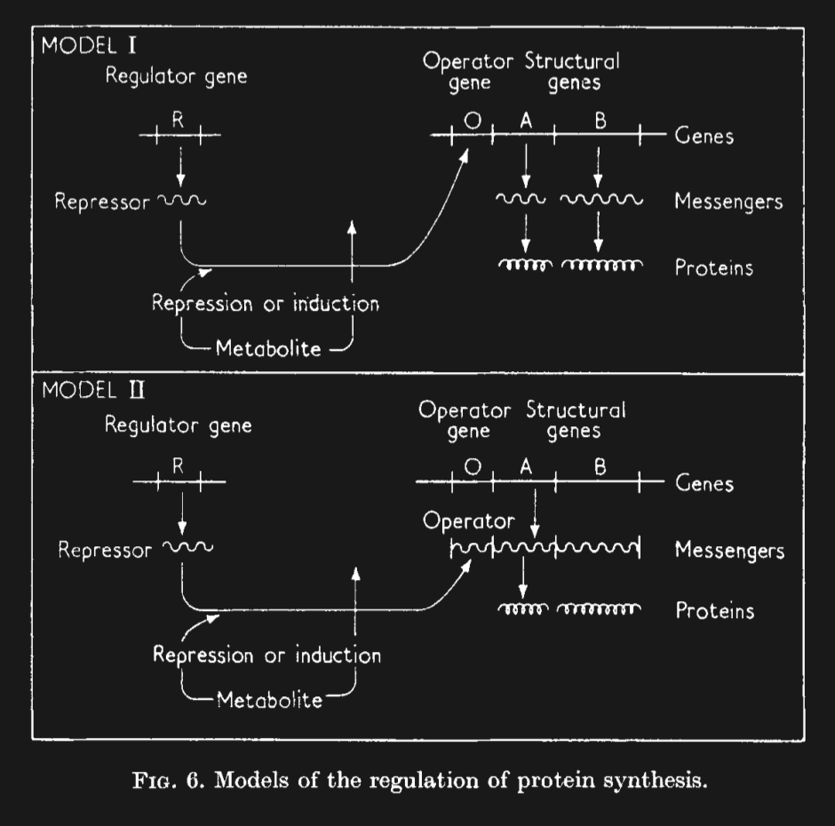{.nostretch fig-align="center" width="55%"}

::: footer
@Jacob_1961
:::

## Genetic Switches and Circuits {auto-animate=true}

{fig-align="center" width="50%"}
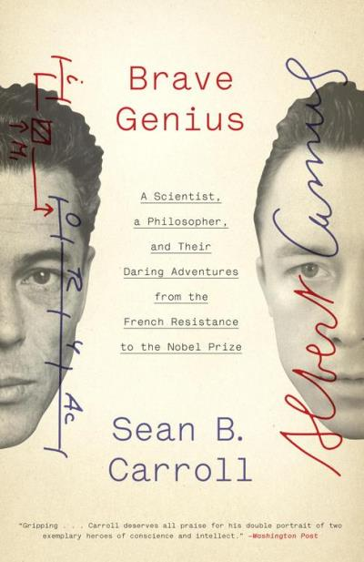{fig-align="right" width="30%"}

::: footer
@Carroll_2013
:::

## Transcriptional Logic Gates

:::: {.columns}

::: {.column width="30%"}

**XOR gate**

<svg viewBox="0 0 240 200" style="width:100%;max-height:200px" xmlns="http://www.w3.org/2000/svg">
  <defs>
    <marker id="xorArr" viewBox="0 0 10 10" refX="9" refY="5" markerWidth="7" markerHeight="7" orient="auto">
      <path d="M0 0 L10 5 L0 10 Z" fill="currentColor"/>
    </marker>
  </defs>
  <line x1="20" y1="70"  x2="88" y2="70"  stroke="currentColor" stroke-width="2"/>
  <line x1="20" y1="130" x2="88" y2="130" stroke="currentColor" stroke-width="2"/>
  <text x="10" y="75"  text-anchor="end" fill="currentColor" font-size="16" font-weight="700">A</text>
  <text x="10" y="135" text-anchor="end" fill="currentColor" font-size="16" font-weight="700">B</text>
  <path d="M 78 40 Q 108 100 78 160" fill="none" stroke="currentColor" stroke-width="2"/>
  <path d="M 90 40 Q 120 100 90 160 Q 150 160 195 100 Q 150 40 90 40 Z" fill="none" stroke="currentColor" stroke-width="2"/>
  <line x1="195" y1="100" x2="225" y2="100" stroke="currentColor" stroke-width="2" marker-end="url(#xorArr)"/>
  <text x="232" y="105" fill="currentColor" font-size="16" font-weight="700">S</text>
</svg>

S = A ⊕ B

<div style="height:40px"></div>

::: {.fragment data-fragment-index="1"}
**AND gate**

<svg viewBox="0 0 240 200" style="width:100%;max-height:200px" xmlns="http://www.w3.org/2000/svg">
  <defs>
    <marker id="andArr" viewBox="0 0 10 10" refX="9" refY="5" markerWidth="7" markerHeight="7" orient="auto">
      <path d="M0 0 L10 5 L0 10 Z" fill="currentColor"/>
    </marker>
  </defs>
  <line x1="20" y1="70"  x2="88" y2="70"  stroke="currentColor" stroke-width="2"/>
  <line x1="20" y1="130" x2="88" y2="130" stroke="currentColor" stroke-width="2"/>
  <text x="10" y="75"  text-anchor="end" fill="currentColor" font-size="16" font-weight="700">A</text>
  <text x="10" y="135" text-anchor="end" fill="currentColor" font-size="16" font-weight="700">B</text>
  <path d="M 88 40 L 140 40 A 60 60 0 0 1 140 160 L 88 160 Z" fill="none" stroke="currentColor" stroke-width="2"/>
  <line x1="200" y1="100" x2="225" y2="100" stroke="currentColor" stroke-width="2" marker-end="url(#andArr)"/>
  <text x="232" y="105" fill="currentColor" font-size="16" font-weight="700">S</text>
</svg>

S = A · B
:::

:::

::: {.column width="70%"}
::: {style="text-align:center"}

**Transcriptional circuit**

<svg viewBox="0 0 420 210" style="width:100%;max-height:200px" xmlns="http://www.w3.org/2000/svg">
  <defs>
    <marker id="tcArr1" viewBox="0 0 10 10" refX="9" refY="5" markerWidth="8" markerHeight="8" orient="auto">
      <path d="M0 0 L10 5 L0 10 Z" fill="currentColor"/>
    </marker>
  </defs>
  <text x="90"  y="40" text-anchor="middle" fill="currentColor" font-size="32" font-weight="700">A</text>
  <text x="190" y="40" text-anchor="middle" fill="currentColor" font-size="32" font-weight="700">B</text>
  <line x1="90"  y1="55" x2="90"  y2="140" stroke="currentColor" stroke-width="2.5" marker-end="url(#tcArr1)"/>
  <line x1="190" y1="55" x2="190" y2="140" stroke="currentColor" stroke-width="2.5" marker-end="url(#tcArr1)"/>
  <line x1="30" y1="160" x2="400" y2="160" stroke="currentColor" stroke-width="3"/>
  <path d="M 280 160 L 280 105 L 350 105" fill="none" stroke="currentColor" stroke-width="2.5" marker-end="url(#tcArr1)"/>
  <text x="375" y="114" text-anchor="middle" fill="currentColor" font-size="30" font-weight="700">S</text>
</svg>

max(A, B),&emsp;&emsp;A + B ⇌ C

::: {.fragment data-fragment-index="1"}
<svg viewBox="0 0 420 210" style="width:100%;max-height:200px" xmlns="http://www.w3.org/2000/svg">
  <defs>
    <marker id="tcArr2" viewBox="0 0 10 10" refX="9" refY="5" markerWidth="8" markerHeight="8" orient="auto">
      <path d="M0 0 L10 5 L0 10 Z" fill="currentColor"/>
    </marker>
  </defs>
  <text x="90"  y="40" text-anchor="middle" fill="currentColor" font-size="32" font-weight="700">A</text>
  <text x="190" y="40" text-anchor="middle" fill="currentColor" font-size="32" font-weight="700">B</text>
  <line x1="90"  y1="55" x2="90"  y2="140" stroke="currentColor" stroke-width="2.5" marker-end="url(#tcArr2)"/>
  <line x1="190" y1="55" x2="190" y2="140" stroke="currentColor" stroke-width="2.5" marker-end="url(#tcArr2)"/>
  <line x1="30" y1="160" x2="400" y2="160" stroke="currentColor" stroke-width="3"/>
  <path d="M 280 160 L 280 105 L 350 105" fill="none" stroke="currentColor" stroke-width="2.5" marker-end="url(#tcArr2)"/>
  <text x="375" y="114" text-anchor="middle" fill="currentColor" font-size="30" font-weight="700">S</text>
</svg>

min(A, B)
:::

:::

:::

::::


## Gene Schedule {auto-animate=true auto-animate-easing="ease-in-out" .smaller}

```{.json}

    "label": "two-bit-adder",
    "input_gene": {
        "base_rates": {
            "$": ["defaults", "gene", "base_rates"],
            "activation": 0.0,
            "protein_decay": 0.0}
    },
    "gate_rates": {
        "$": ["defaults", "gene", "base_rates"],
        "activation": 1.0,
        "deactivation": 20.0,
        "transcription": 0.0005
    },
    "genes": [
        {
            "name": "S0",
            "base_rates": {"$": "xor_gate_rates"},
            "activation": {
                "slots": [
                    {"from": "A0", "at": 25.0},
                    {"from": "B0", "at": 25.0}
                ],
                "aggregate": "minimum"
            },
            "repression": [
                {"from": "C0", "at": 1.0}
            ]
        },
        {
            "name": "C0",
            "base_rates": {"$": "gate_rates"},
            "activation": {
                "slots": [
                    {"from": "A0", "at": 25.0},
                    {"from": "B0", "at": 25.0}
                ],
                "aggregate": "maximum"
            }
        }
    ]

```

## Gene Schedule {auto-animate=true auto-animate-easing="ease-in-out" .smaller}

```{.json}
    "genes": [
        {
            "name": "S0",
            "base_rates": {"$": "xor_gate_rates"},
            "activation": {
                "slots": [
                    {"from": "A0", "at": 25.0},
                    {"from": "B0", "at": 25.0}
                ],
                "aggregate": "minimum"
            },
            "repression": [
                {"from": "C0", "at": 1.0}
            ]
        },
        {
            "name": "C0",
            "base_rates": {"$": "gate_rates"},
            "activation": {
                "slots": [
                    {"from": "A0", "at": 25.0},
                    {"from": "B0", "at": 25.0}
                ],
                "aggregate": "maximum"
            }
        }
    ]
```

## Gene Schedule {auto-animate=true auto-animate-easing="ease-in-out" .smaller}

```{.json code-line-numbers="|1|3|4|5-10|11-13"}
    "genes": [
        {
            "name": "S0",
            "base_rates": {"$": "xor_gate_rates"},
            "activation": {
                "slots": [
                    {"from": "A0", "at": 25.0},
                    {"from": "B0", "at": 25.0}
                ],
                "aggregate": "minimum"
            },
            "repression": [
                {"from": "C0", "at": 1.0}
            ]
        },
        {
            "name": "C0",
            "base_rates": {"$": "gate_rates"},
            "activation": {
                "slots": [
                    {"from": "A0", "at": 25.0},
                    {"from": "B0", "at": 25.0}
                ],
                "aggregate": "maximum"
            }
        }
    ]
```

## Biological Logic Gates {auto-animate=true}

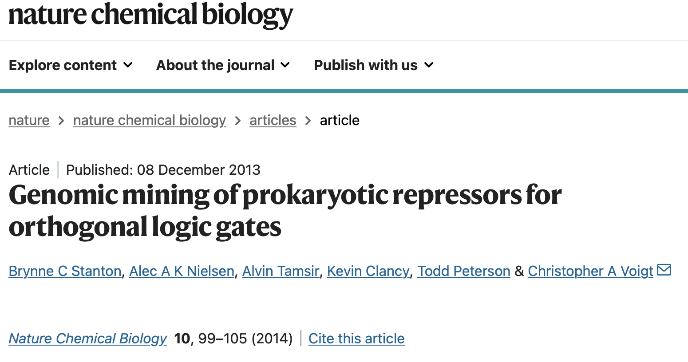{.nostretch fig-align="center"}

::: footer
From @Stanton_2013
:::

## Biological 2-bit Adder

::: {style="display:flex; justify-content:center; align-items:center; height:80vh"}

<video src="images/adder.mp4" controls autoplay loop muted style="max-width:90%; max-height:80vh;"></video>

:::


## Biological Logic Gates {auto-animate=true}

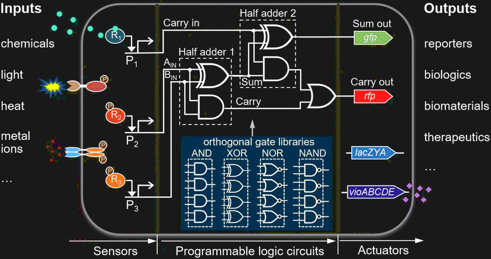{.nostretch fig-align="center"}

::: footer
From @Xiang_2018
:::

## Biological Logic Circuits

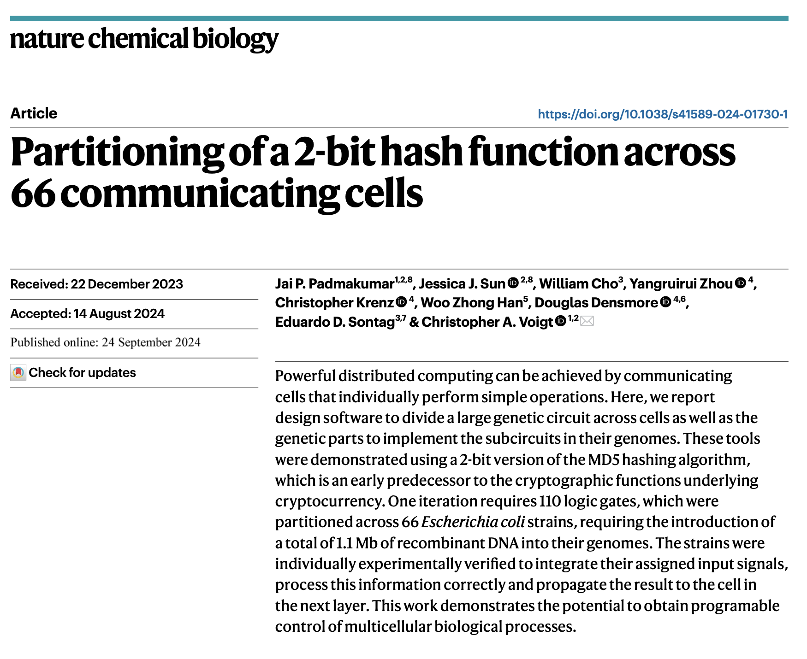{.nostretch fig-align="center"}

::: footer
From @Padmakumar_2024
:::

## Biological Finite State Machines

*A unicellular walker controlled by a microtubule-
based finite-state machine*

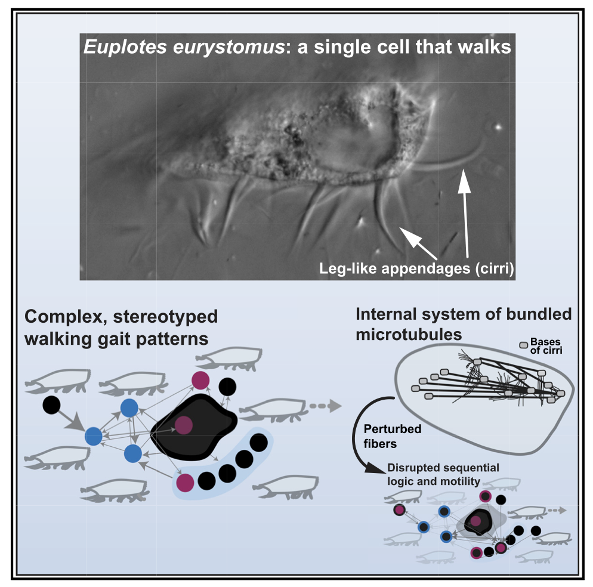{.nostretch fig-align="center" width="65%"}

::: footer
From @Larson_2022
:::

## Biological Finite State Machines

*A Markovian dynamics for Caenorhabditis elegans behavior across scales*

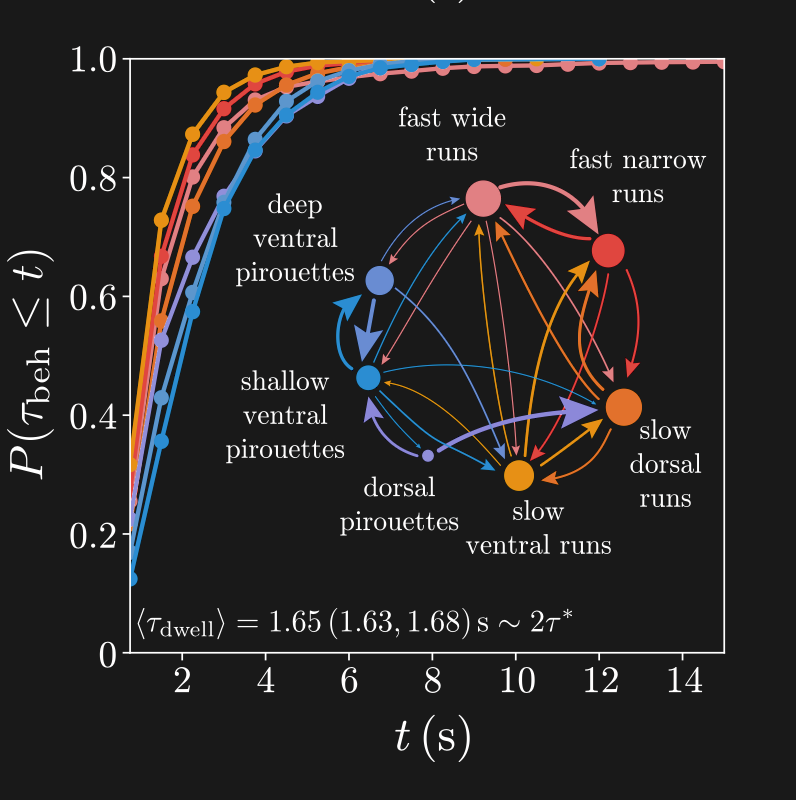{.nostretch fig-align="center" width="75%"}

::: footer
From @Costa_2024
:::

## A Biological Universal Turing Machine?

<br/>

A biological systems whose behavior is determined by a system of dynamical rules and current inputs, which can change those rules based on the current inputs and past history of the system 

<br/>

::: {.fragment}
*An RNA-Based Theory of Natural Universal Computation*
:::

::: {.notes}
So why this and not simply automata and evolution? There are a few reasons, for one, Turing Award winning computer scientist Les Valiant argues that there simply has not been enough time for random search to have evolved the diversity of life we see, and another is that evolution is very wasteful.
:::

::: footer
From @Akhlaghpour_2022
:::

## Cell Learning 

<br/>

If such a thing exists, how might we go about finding and understanding it?

<br/>

::: incremental
 - Finding a system whose capacity to learn exceeds that of a simple automata
 - and composed of components whose behavior we know how to describe
:::

## Cell Learning 

::: {style="display:flex; justify-content:center"}

| Glucose | Galactose | Gal Promoter |
|:-------:|:---------:|:------------:|
|    0    |     0     |      0       |
|    1    |     0     |      0       |
|    1    |     1     |      0       |
|    0    |     1     |      1       |

:::

::: footer
@stolovickiSyntheticGeneRecruitment2006, @woronoffMetabolicCostRapid2020
:::

## Cell Learning 

::: {style="text-align:center"}

```{dot}
//| fig-width: 5.5
//| fig-height: 4
digraph D {
  bgcolor = "transparent"
  ranksep=0.3
  node [color="white", fontcolor=white]
  edge [color="white", fontcolor=white]
  D [shape=cds,label="HIS3",orientation=180]
  A [shape=promoter,label="", label="Gal1/10", labelloc="b"]
  B [shape=cds,label="GFP"]
  { rank=same; D -> A -> B [style=invis] }
  node [shape=ellipse, fixedsize=true, width=1, height=0.7];
  E [shape=oval,label="Gal4p"]
  F [shape=oval,label="Gal80p"]
  G [shape=oval,label="Gal3p"]
  H [shape=diamond,label="gal"]
  E -> A
  { rank=same; H->G}
  edge [arrowhead=tee]
  G -> F -> E
}
```

:::

::: footer
@stolovickiSyntheticGeneRecruitment2006, @woronoffMetabolicCostRapid2020
:::

## Cell Learning 

::: {style="display:flex; justify-content:center; font-size:0.65em"}

| Glucose | Galactose | Gal Promoter | HIS | Alive |
|:-------:|:---------:|:------------:|:---:|:-----:|
|    0    |     0     |      0       |  0  |   💀   |
|    1    |     0     |      0       |  0  |   💀   |
|    1    |     1     |      0       |  0  |   💀   |
|    0    |     1     |      1       |  1  |   🙂   |

:::

::: {.fragment}
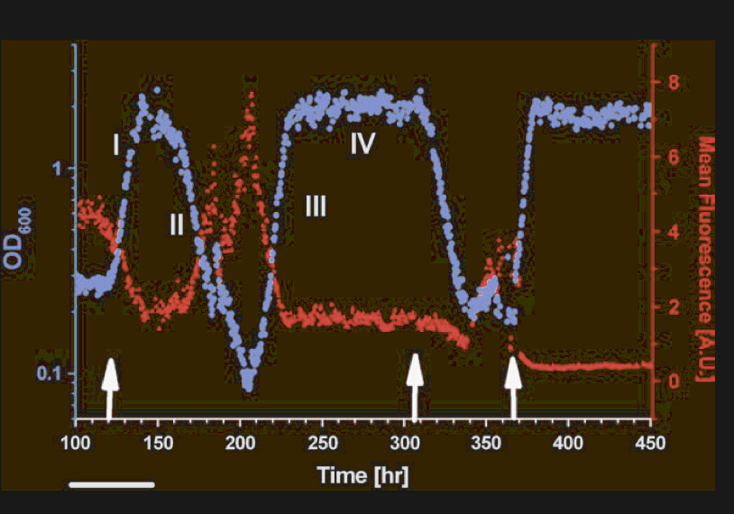{fig-align="center" width="50%"}
:::

::: footer
@stolovickiSyntheticGeneRecruitment2006, @woronoffMetabolicCostRapid2020
:::

## Plasmid Design and Transformation

:::: {.columns}

::: {.column width="50%"}
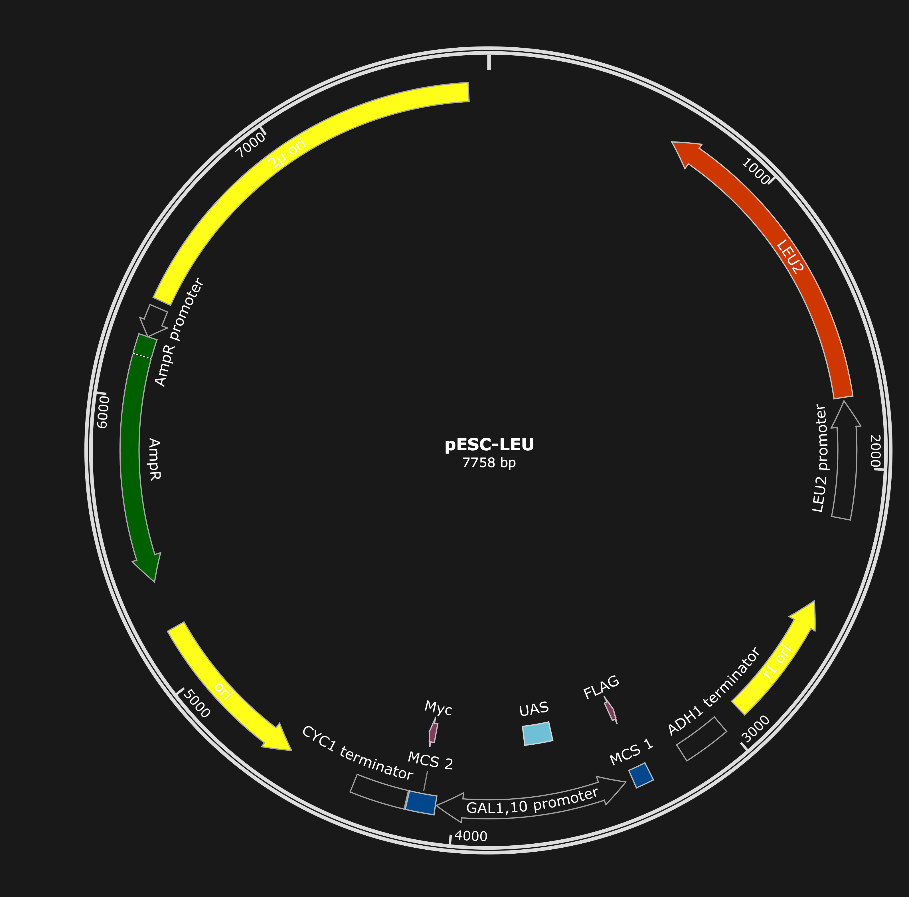
:::

::: {.column width="50%"}
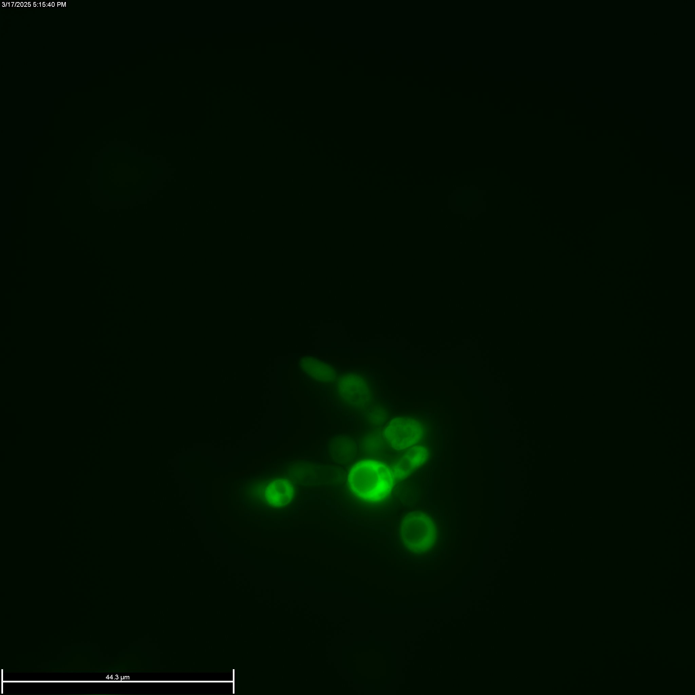
:::

::::

## Bioreactor Design

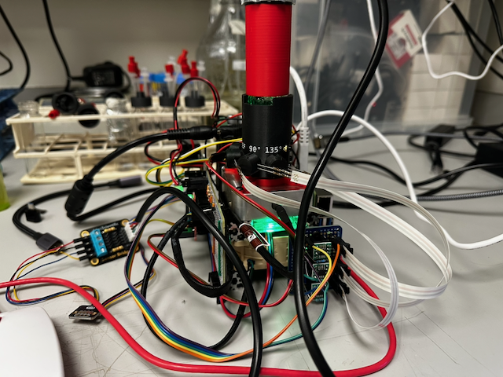{.nostretch fig-align="center" width="75%"}

<div style="font-size:0.85em">

```bash
curl -H "Authorization: Bearer test123" \
     https://issued-fantasy-fighter-specials.trycloudflare.com/api/temp_sensor/state
```
</div>

::: footer

[Click Here for Build Notes](https://notes.livingphysics.org/build_posts/gen3_reactor_build/)

:::


## Gas Composition Sensing

::: {style="text-align:center"}

```{julia}
#| echo: true
#| code-fold: true
using CSV, DataFrames, HTTP
using CairoMakie: Figure, Axis, lines!, hidespines!, hidexdecorations!

url = "https://raw.githubusercontent.com/livingphysics/bioreactor_v3/refs/heads/experiments/src/bioreactor_data/20260303_103138/bioreactor_data.csv"
df = CSV.read(HTTP.get(url).body, DataFrame)

fig = Figure()
ax1 = Axis(fig[1,1], ylabel="CO2 (ppm)", yticklabelcolor=:blue, ylabelcolor=:blue)
ax2 = Axis(fig[1,1], ylabel="O2 (%)", yticklabelcolor=:red,
           yaxisposition=:right, ylabelcolor=:red)

hidespines!(ax2)
hidexdecorations!(ax2)  # don't double-draw x ticks

lines!(ax1, df.elapsed_time/3600, df.CO2_ppm, color=:blue, label="CO2")
lines!(ax2, df.elapsed_time/3600, df.O2_percent, color=:red, label="O2")

fig
```

:::

## Glucose Adaptation

::: {data-id="growth-plot" style="text-align:center"}

```{julia}
#| echo: true
#| code-fold: true
using CSV, DataFrames, Plots, HTTP

theme(:dark)
default(bg_outside=:transparent, bg_inside="#191919",
        fg_color=:white, fg_color_axis=:white,
        fg_color_border=:white, fg_color_grid=RGBA(1,1,1,0.15),
        fg_color_text=:white, fg_color_guide=:white,
        fg_color_title=:white, fg_color_legend=:white)

url_base = "https://raw.githubusercontent.com/livingphysics/RPi-Biosensor/refs/heads/main/data/"

function make_panel(fname, ttl, show_legend)
    response = HTTP.get(url_base * fname)
    data = CSV.read(response.body, DataFrame)
    t_run = data.elapsed ./ 3600
    OD = [data[:, i+1] for i in 1:4]
    od_max = maximum(maximum.(OD))
    p = plot()
    for i in 1:4
        norm_od = (od_max .- OD[i]) ./ od_max
        plot!(p, t_run, norm_od,
            linestyle=:dash,
            label=show_legend ? "OD $i" : "")
    end
    plot!(p,
        title=ttl, xlabel="time (h)", ylabel="Relative OD",
        xlims=(0, 50),
        guidefontsize=12, titlefontsize=12, legendfontsize=10,
        legend=show_legend ? :bottomright : false,
        framestyle=:box)
    return p
end

gal  = make_panel("250829_naive_galhis_csm-his-leu-gal.csv", "2% Galactose",      false)
glu1 = make_panel("250827_yeast_galhis_csm-his-leu-glu.csv", "2% Glucose Run 1",  true)

display(plot(gal, glu1, layout=(2, 1), size=(900, 500)))
```

:::

## Glucose Adaptation 

::: {data-id="growth-plot" style="text-align:center"}

```{julia}
#| echo: true
#| code-fold: true
glu2 = make_panel("250901_naive_galhis_csm-his-leu-glu.csv", "2% Glucose Run 2", false)
display(plot(glu1, glu2, layout=(3, 1), size=(900, 720)))
```

:::
## Glucose Adaptation 

:::{style="text-align:center"}

```{julia}
#| echo: true
#| code-fold: true
using CSV, DataFrames, Plots, HTTP

# Dark theme (redundant if previous chunk ran, but makes this chunk self-contained)
theme(:dark)
default(bg_outside=:transparent, bg_inside="#191919",
        fg_color=:white, fg_color_axis=:white,
        fg_color_border=:white, fg_color_grid=RGBA(1,1,1,0.15),
        fg_color_text=:white, fg_color_guide=:white,
        fg_color_title=:white, fg_color_legend=:white)

url_base = "https://raw.githubusercontent.com/livingphysics/Bioreactor_v2/refs/heads/main/bioreactor_data/"
response = HTTP.get(url_base * "20250901_131355_bioreactor_data.csv")
data = CSV.read(response.body, DataFrame)

t_run = data.time ./ 3600
OD = [data[:, i+5] for i in 1:4]
od_max = maximum(maximum.(OD))

p = plot()
for i in 1:4
    norm_od = (od_max .- OD[i]) ./ od_max
    plot!(p, t_run, norm_od,
        linestyle=:dash,
        label="OD $i")
end
plot!(p,
    title="2% Glucose",
    xlabel="time (h)", ylabel="Relative OD",
    xlims=(0, 90),
    guidefontsize=12, titlefontsize=12, legendfontsize=10,
    legend=:bottomright,
    framestyle=:box)

display(plot(p, layout=(1, 1), size=(900, 500), left_margin=8Plots.mm))
```

:::
## Glucose shuts down the promoter
::: {#fig-gfp_expression layout-ncol=2}


Photomicrographs of rewired cell pre and post adaptation to glucose.
:::

## Colony assays do not support a mutational model

<video src="images/Composite-1.mp4" controls autoplay loop muted playsinline style="max-width:90%; max-height:75vh; display:block; margin:0 auto;"></video>

Time-lapse of 2 colonies growing under a glass coverslip on a +glu-his-leu agar plate


## Improved Colony Assay

<video src="images/GalHis-Gellan-Series012-2.mp4" controls autoplay loop muted playsinline style="max-width:90%; max-height:75vh; display:block; margin:0 auto;"></video>

Time-lapse of 2 colonies growing under a glass coverslip on a +glu-his-leu agar plate

## Continuous Culture

::: {style="text-align:center"}

```{julia}
#| echo: false
using CSV, DataFrames, HTTP, Plots, Statistics, LinearAlgebra

const CSV_URL = "https://raw.githubusercontent.com/livingphysics/bioreactor_v3/main/src/bioreactor_data/bioreactor_data.csv"
df = CSV.read(HTTP.get(CSV_URL).body, DataFrame)

times = Float64.(df.elapsed_time)
measurements = Float64.(df.Eyespy_sct_V)
pump_cum = Float64.(df.pump_inflow_time_s)
pump_events = falses(length(times))
pump_events[2:end] = diff(pump_cum) .> 0

function run_ekf_replay(times, measurements, pump_events;
                        R=0.001, Q_growth_rate=5e-12,
                        initial_growth_rate=1.0, initial_P_r=0.0005^2,
                        pump_distrust_cycles=10, pump_distrust_P_od=nothing)
    n = length(times)
    pump_distrust_P_od === nothing && (pump_distrust_P_od = 10.0 * R)
    od_est           = fill(NaN, n)
    growth_rate      = fill(NaN, n)
    doubling_time_s  = fill(NaN, n)
    od_std           = fill(NaN, n)
    r_std            = fill(NaN, n)
    dt_std           = fill(NaN, n)

    x = [measurements[1], initial_growth_rate]
    P = [R 0.0; 0.0 initial_P_r]
    distrust_counter = 0
    dt_median = median(diff(times))
    od_est[1] = x[1]; growth_rate[1] = x[2]
    od_std[1] = sqrt(R); r_std[1] = sqrt(initial_P_r)
    I2 = Matrix{Float64}(I, 2, 2)
    H_vec = [1.0, 0.0]

    for i in 2:n
        z_k = measurements[i]
        if isnan(z_k)
            od_est[i] = od_est[i-1]; growth_rate[i] = growth_rate[i-1]
            doubling_time_s[i] = doubling_time_s[i-1]
            od_std[i] = od_std[i-1]; r_std[i] = r_std[i-1]; dt_std[i] = dt_std[i-1]
            continue
        end
        pump_events[i] && (distrust_counter = pump_distrust_cycles)

        od_k, r_k = x[1], x[2]
        x_pred = [od_k * r_k, r_k]
        F = [r_k od_k; 0.0 1.0]
        Q_mat = [0.0 0.0; 0.0 Q_growth_rate]
        P_pred = F * P * F' + Q_mat

        if pump_events[i] || distrust_counter > 0
            P_pred[1, 1] = pump_distrust_P_od
            P_pred[1, 2] = 0.0; P_pred[2, 1] = 0.0
            x_pred[1] = z_k
            pump_events[i] || (distrust_counter -= 1)
        end

        y = z_k - x_pred[1]
        S = P_pred[1, 1] + R
        K = P_pred[:, 1] ./ S
        x_updated = x_pred .+ K .* y
        P_updated = (I2 - K * H_vec') * P_pred

        if abs(z_k - x_pred[1]) > 5.0 * sqrt(R)
            P_updated[1, 2] = 0.0; P_updated[2, 1] = 0.0
            P_updated[1, 1] = (x_updated[1] - z_k)^2
        end

        x, P = x_updated, P_updated
        od_est[i] = x[1]; growth_rate[i] = x[2]
        od_std[i] = sqrt(P[1, 1]); r_std[i] = sqrt(P[2, 2])

        r_est = x[2]
        if r_est > 1.0
            ln_r = log(r_est)
            dt_val = dt_median * log(2.0) / ln_r
            if dt_val <= 86400.0
                doubling_time_s[i] = dt_val
                dt_std[i] = dt_median * log(2.0) * r_std[i] / (r_est * ln_r^2)
            end
        end
    end

    return (; od_est, growth_rate, doubling_time_s, od_std, r_std, dt_std)
end

result = run_ekf_replay(times, measurements, pump_events; Q_growth_rate=5e-12)

t_h_all  = times ./ 3600.0
mask     = t_h_all .<= 9.0
t_h      = t_h_all[mask]
raw_od   = measurements[mask]
ekf_od   = result.od_est[mask]
od_sd    = result.od_std[mask]
dt_min   = result.doubling_time_s[mask] ./ 60.0
dt_sd_min = result.dt_std[mask] ./ 60.0
temp     = Float64.(df.temperature_C)[mask]
pump_times = t_h[pump_events[mask]]

# Theme inherits from earlier chunks (theme(:dark); default(...))
# --- OD panel
p_od = scatter(t_h, raw_od; ms=1.5, color="#cccccc", label="Raw OD", alpha=0.7)
plot!(p_od, t_h, ekf_od; color="#2196F3", lw=1.2, label="EKF OD est",
      ribbon=od_sd, fillalpha=0.20)
for pt in pump_times
    vline!(p_od, [pt]; color="#FF5722", alpha=0.3, lw=0.8, label="")
end
ylabel!(p_od, "OD (V)")

# --- Doubling-time panel (ribbon clipped at 0)
dt_low_diff = @. ifelse(isfinite(dt_min) & isfinite(dt_sd_min), min(dt_sd_min, dt_min), 0.0)
dt_up_diff  = @. ifelse(isfinite(dt_min) & isfinite(dt_sd_min), dt_sd_min, 0.0)
p_dt = plot(t_h, dt_min; color="#9C27B0", lw=1.2, label="Doubling time",
            ribbon=(dt_low_diff, dt_up_diff), fillalpha=0.20)
for pt in pump_times
    vline!(p_dt, [pt]; color="#FF5722", alpha=0.3, lw=0.8, label="")
end
let finite_vals = dt_min[isfinite.(dt_min)]
    if !isempty(finite_vals)
        p5, p95 = quantile(finite_vals, [0.05, 0.95])
        margin = (p95 - p5) * 0.15
        ylims!(p_dt, (max(0.0, p5 - margin), p95 + margin))
    end
end
ylabel!(p_dt, "Doubling time (min)")

# --- Temperature panel
p_temp = plot(t_h, temp; color="#E65100", lw=1.2, label="Temperature")
ylabel!(p_temp, "Temperature (°C)")
xlabel!(p_temp, "Elapsed time (hours)")

display(plot(p_od, p_dt, p_temp; layout=(3, 1), size=(1000, 500),
             legend=:topleft, left_margin=10Plots.mm, bottom_margin=6Plots.mm))
```

:::

::: footer
@Hoffmann2017-po
:::


## References

::: {#refs}
:::

## Thank You
